# 第六章 安卓系统访问控制策略与机制

## 实验内容
- [x] ADB实验
    + [x] 命令行
    + [x] Activity Manager (am)【GIF演示】
    + [x] 软件包管理器 (pm)
    + [x] 其他adb实验【GIF演示】
- [x] HelloWorld v1

### 实验环境
- Android Studio
- 命令行
- AVD：PIX 4 API 30 
- 将adb.exe添加到环境变量
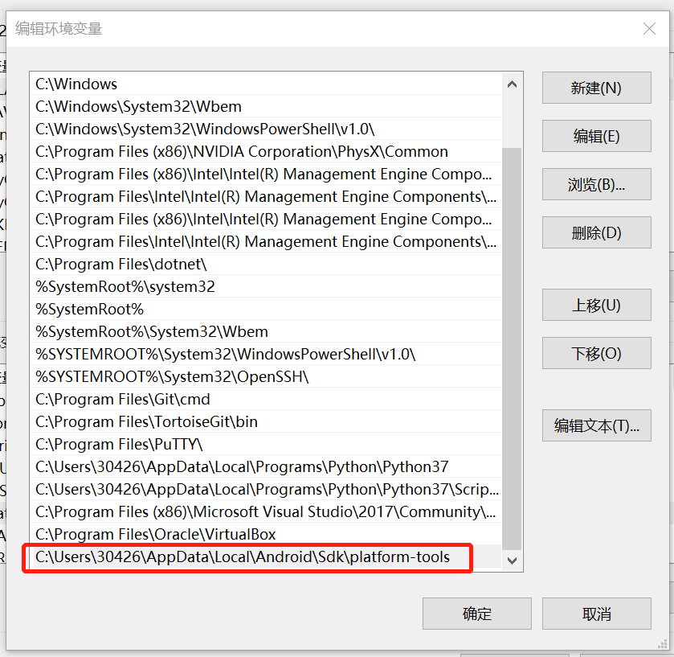

### ADB实验

#### 命令行

```
# 查看开启的模拟器
adb devices

# 连接模拟器终端
adb -s emulator-5554 shell

# 输出环境变量
echo $PATH

# 查看系统版本
uname -a

# 查看当前目录下文件
ls

# 查看网络信息
ifconfig
```
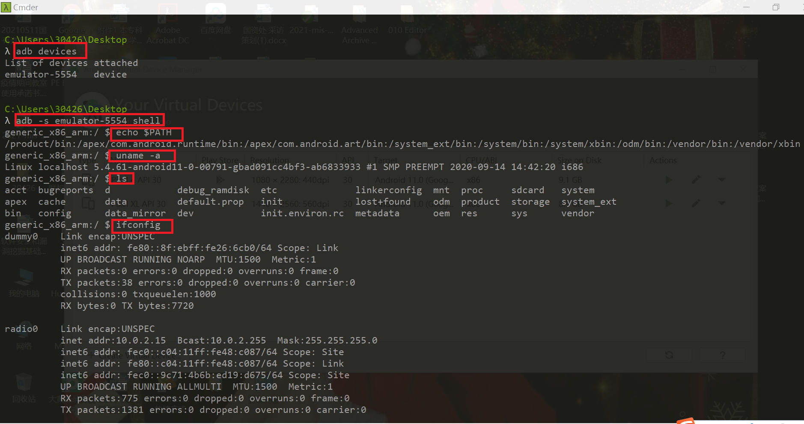

```
# 将文件复制到设备/从设备复制文件
adb pull remote local
adb push local remote
```

- 将文件从设备复制到本地
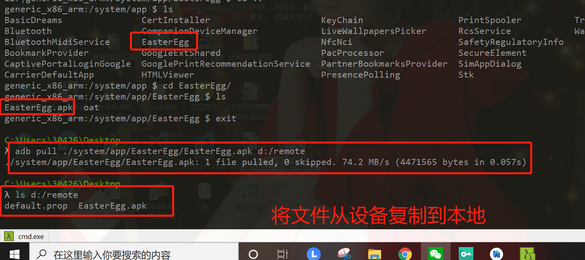

- 将文件从本地上传到设备
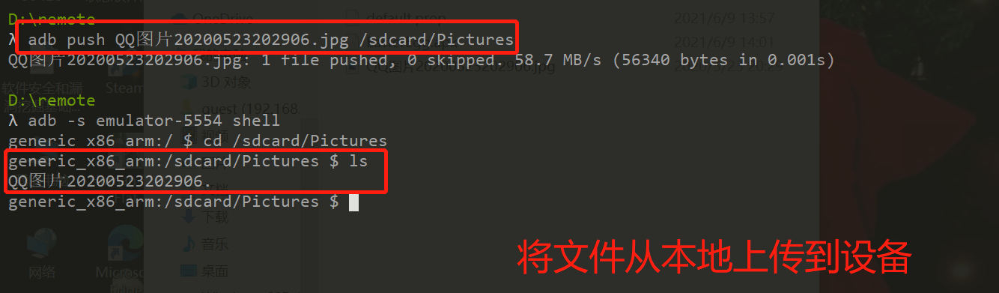

```
# 安装应用
adb install path_to_apk
```
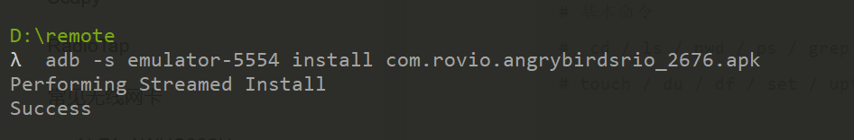


#### Activity Manager (am)

在Android中，除了从界面上启动程序之外，还可以从命令行启动程序，使用的是命令行工具am (activity manager ).
以下列出部分使用说明，详情见[课本](https://c4pr1c3.github.io/cuc-mis/chap0x06/exp.html#adb%E5%AE%9E%E9%AA%8C)
```
usage: am [subcommand] [options]
usage: am start [-D] [-W] [-P <FILE>] [--start-profiler <FILE>]
               [--R COUNT] [-S] [--opengl-trace] <INTENT>
       am startservice <INTENT>
       am force-stop <PACKAGE>
```

对以下实例做演示，详情见录屏：

```
# Camera（照相机）的启动方法为:
am start -n com.android.camera/com.android.camera.Camera

# Browser（浏览器）的启动方法为：
am start -n com.android.browser/com.android.browser.BrowserActivity

# 启动浏览器 :
am start -a android.intent.action.VIEW -d  http://sec.cuc.edu.cn/

# 拨打电话 :
am start -a android.intent.action.CALL -d tel:10086

# 发短信：
adb shell am start -a android.intent.action.SENDTO -d sms:10086 --es sms_body ye --ez exit_on_sent true
```

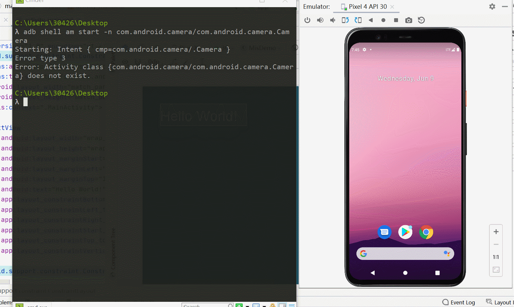

照相机和浏览器在Android 11.0版本系统中不支持am启动命令

#### 软件包管理器 (pm)

在 adb shell 中，可以使用软件包管理器 (pm) 工具发出命令，以对设备上安装的应用软件包进行操作和查询。在 shell 中，此语法为：
```
pm command
```

执行以下pm有关指令：

```
pm list permission-groups 列出所有权限分组信息
pm path PACKAGE 查看apk路径 
查看第三方软件包
pm list packages -3
```
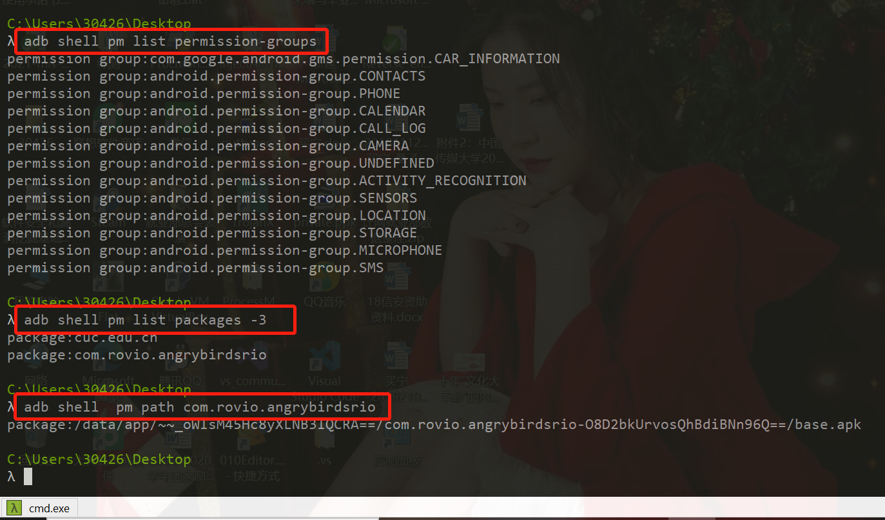

#### 其他adb实验

```
# 常用的按键对应的KEY_CODE
adb shell input keyevent 22 //焦点去到发送键
adb shell input keyevent 66 //回车按下

adb shell input keyevent 4 // 物理返回键
adb shell input keyevent 3 // 物理HOME键

# android 4.0+
$ input
usage: input ...
       input text <string>
       input keyevent <key code number or name>
       input tap <x> <y>
       input swipe <x1> <y1> <x2> <y2>
```
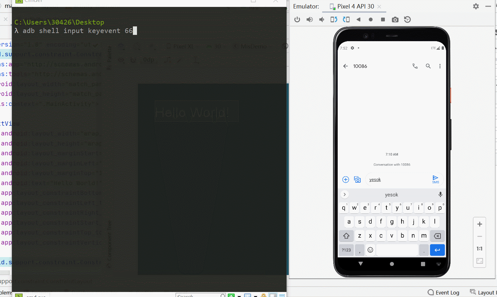


### Hello World v1
- Application Name设置为：MISDemo
- Company Domain设置为：cuc.edu.cn
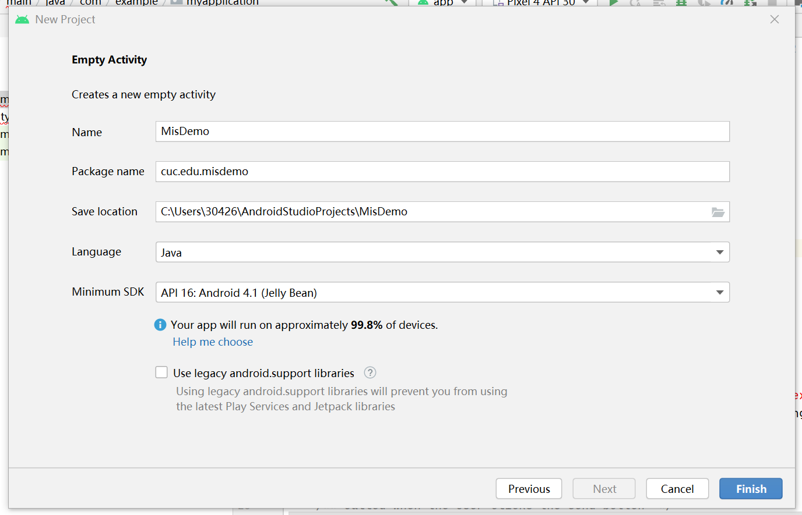

- 可以直接运行该项目，得到下图结果
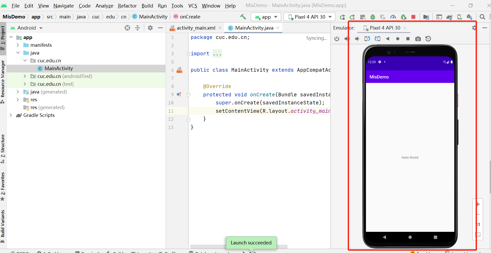

- 然后按照[教程-构建首个应用](https://developer.android.google.cn/training/basics/firstapp/building-ui)进行操作，得到的应用可以发送信息并成功跳转，效果如下：
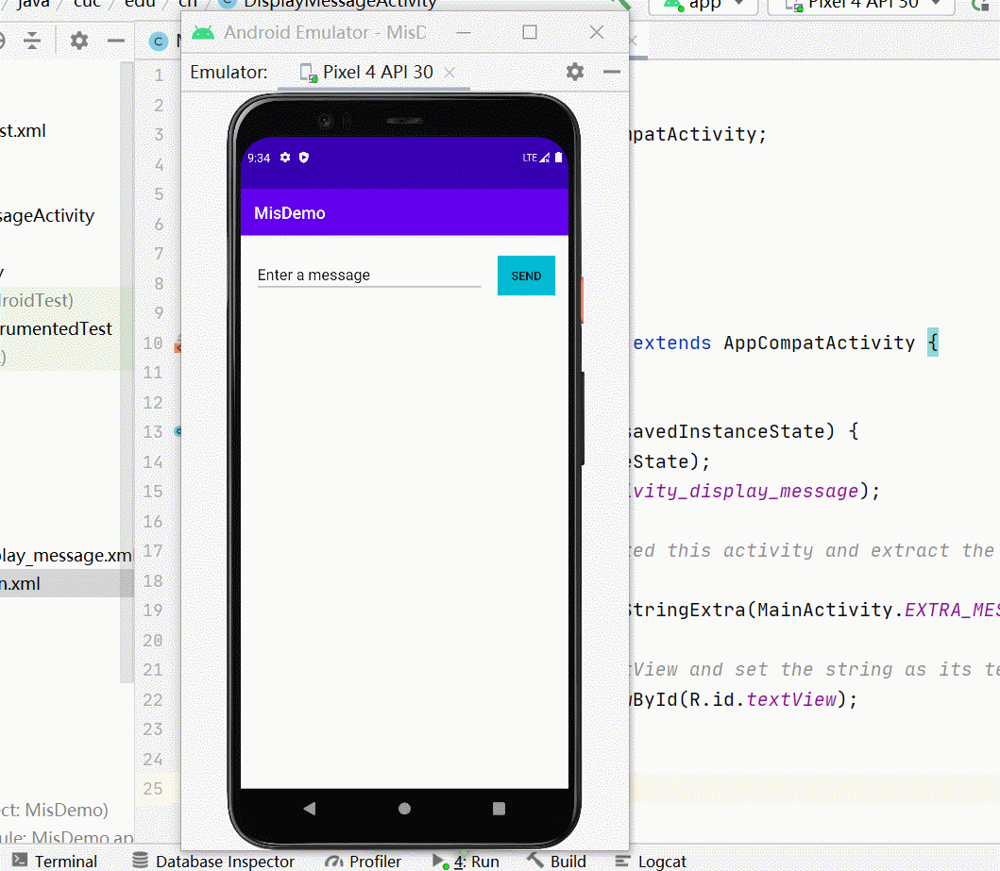

### 问题回答

- [x] 按照向导创建的工程在模拟器里运行成功的前提下，生成的APK文件在哪儿保存的？
    ```
    C:\Users\30426\AndroidStudioProjects\MisDemo\app\build\outputs\apk
    ```

- [x] 使用adb shell是否可以绕过MainActivity页面直接“唤起”第二个DisplayMessageActivity页面？是否可以在直接唤起的这个DisplayMessageActivity页面上显示自定义的一段文字，比如：你好移动互联网安全
    ```
    可以，使用代码：
    adb -s emulator-5554 shell am start -n cuc.edu.cn/cuc.edu.cn.DisplayMessageActivity --es "cuc.edu.cn.MESSAGE" "Hello WWWorld"
    ```
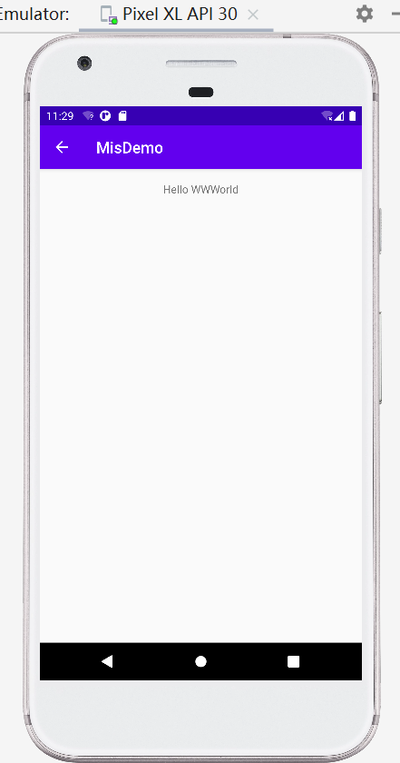

- [x] 如何实现在真机上运行你开发的这个Hello World程序？
    >按照以下步骤设置设备：
    1.使用一根 USB 线将设备连接到开发机器。如果您是在 Windows 上开发的，则可能需要为设备安装合适的 USB 驱动程序。
    2.执行以下步骤，在开发者选项窗口中启用 USB 调试：
        a.打开设置应用。
        b.如果您的设备使用 Android v8.0 或更高版本，请选择系统。否则，请继续执行下一步。
        c.滚动到底部，然后选择关于手机。
        d.滚动到底部，然后点按版本号七次。
        e.返回上一屏幕，滚动到底部，然后点按开发者选项。
        f.在开发者选项窗口中，向下滚动以查找并启用 USB 调试。
    按照以下步骤操作，在设备上运行应用：
    1.在 Android Studio 中，从工具栏中的运行/调试配置下拉菜单中选择您的应用。
    2.在工具栏中，从目标设备下拉菜单中选择要用来运行应用的设备。

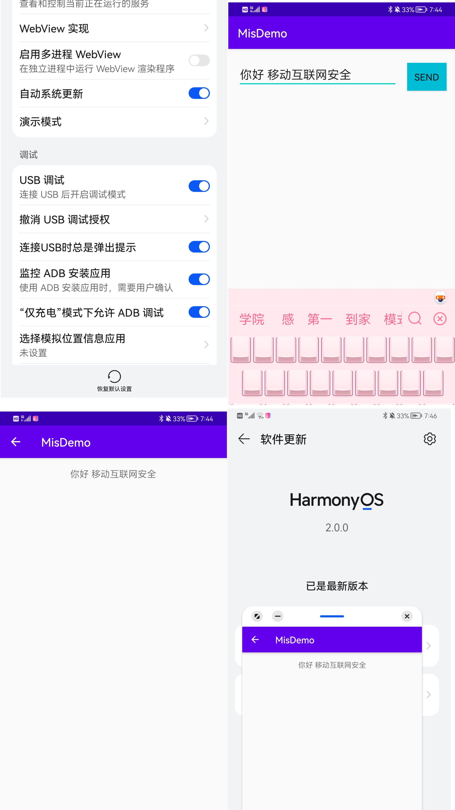
开启调试模式后将APK传到手机上，可以正常运行，甚至支持分屏运行【见小图4】


- [x] 如何修改代码实现通过 adb shell am start -a android.intent.action.VIEW -d http://sec.cuc.edu.cn/ 可以让我们的cuc.edu.cn.misdemo程序出现在“用于打开浏览器的应用程序选择列表”？
    ```
    向AndroidManifest.xml中添加代码
    <action android:name="android.intent.action.VIEW" />
    <category android:name="android.intent.category.DEFAULT" />
    <category android:name="android.intent.category.BROWSABLE" />
    <data android:scheme="http" />
    <data android:scheme="https" />
    ```

- [x] 如何修改应用程序默认图标？
    在`res/mipmap`下新建 Image Assert，可以更换图标样式，颜色。
    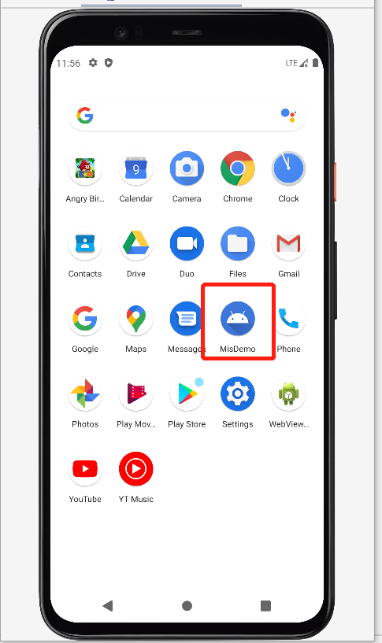


- [x] 如何修改代码使得应用程序图标在手机主屏幕上实现隐藏？
    ```
    向MainActivity.java中添加代码

    PackageManager packageManager = getPackageManager();
    ComponentName componentName = new ComponentName(MainActivity.this, MainActivity.class);
    packageManager.setComponentEnabledSetting(componentName,
    PackageManager.COMPONENT_ENABLED_STATE_DISABLED, PackageManager.DONT_KILL_APP);
    ```

### 参考资料
- [课本](https://c4pr1c3.github.io/cuc-mis/chap0x06/exp.html#adb%E5%AE%9E%E9%AA%8C)
- [官方教程](https://developer.android.google.cn/training/basics/firstapp/running-app)
- [APK下载网址](https://androidappsapk.co/download/com.rovio.angrybirdsrio/d15a76fe5efd624420909e1f9e6df262/)