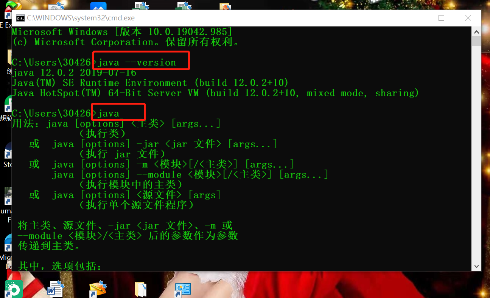
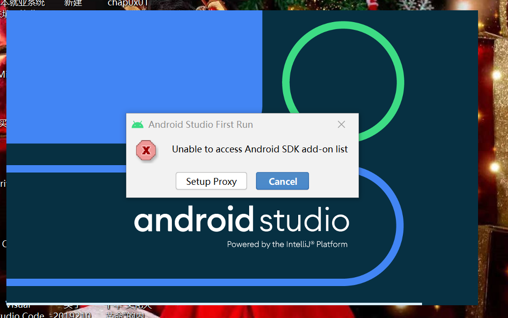
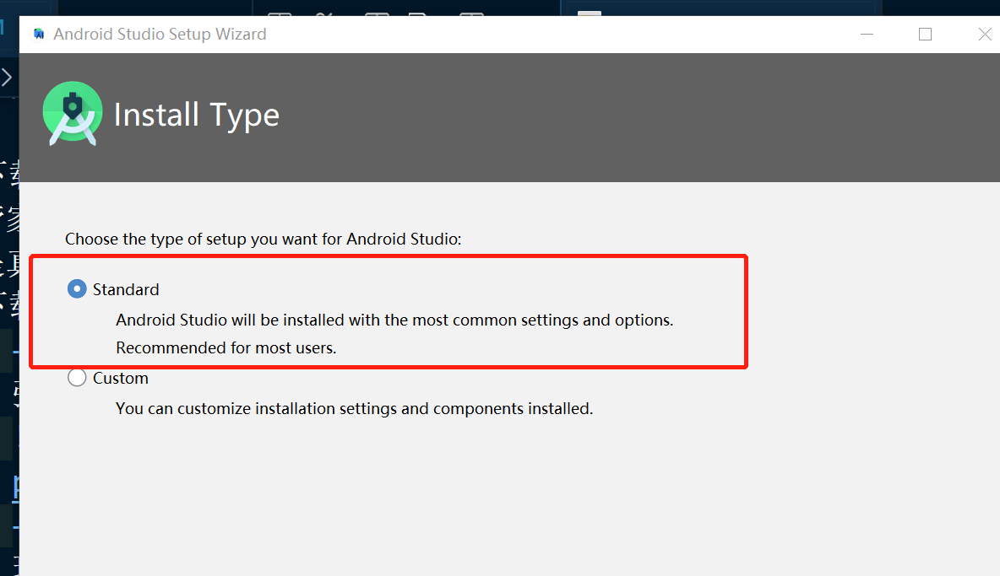
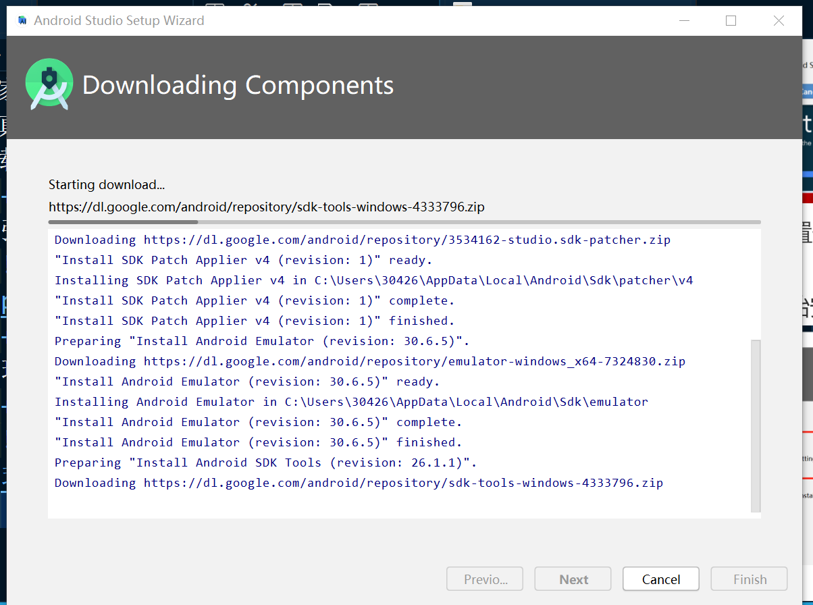
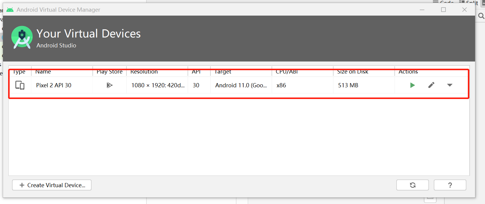
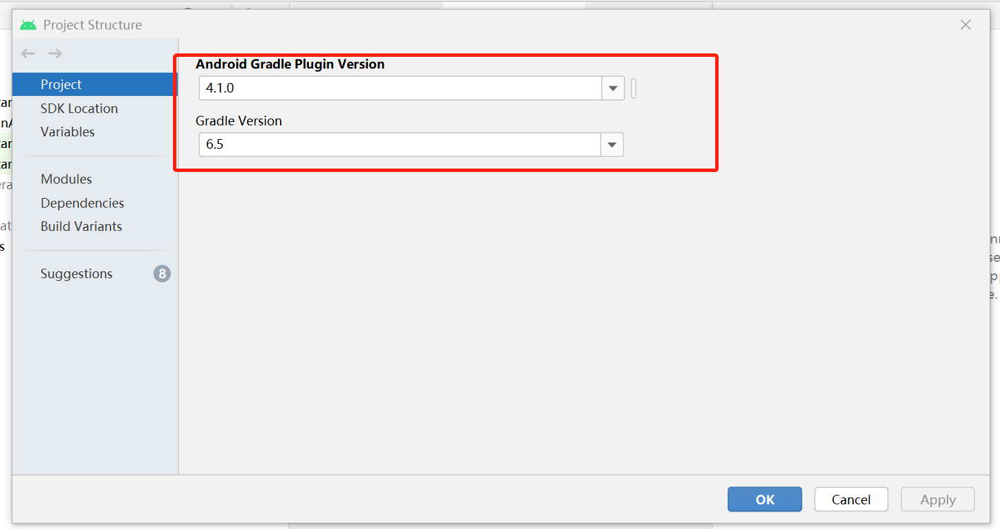
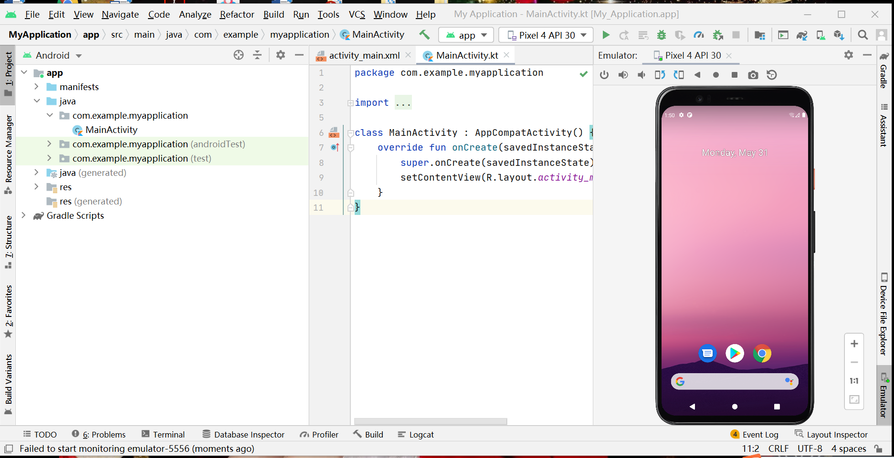
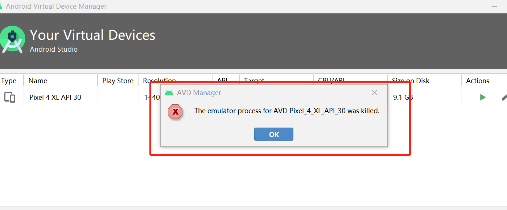
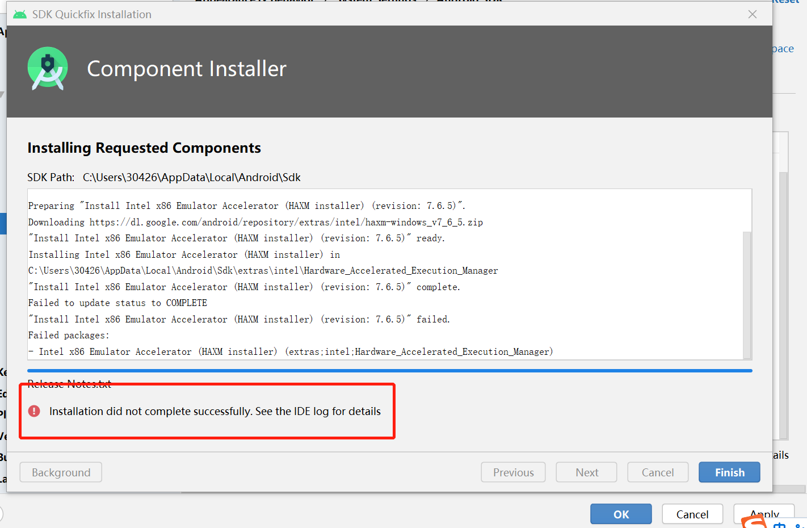

# 2021-mis-public-MN962464

# 第五章实验 Android模拟器环境搭建

## 实验内容

- [x] 安装和配置 Java SDK

- [x] 安装Android Studio

- [x] 下载安装 Android SDK

- [x] 配置 Android 模拟器运行环境

- [x] 配置 Gradle 编译环境

## 实验环境

- windows10
- Java(TM) SE Development Kit 12.0.2(64bit)
- Android Studio 4.1

### 安装和配置 Java SDK

- 之前在学习Java课时就已经完成了java环境的配置，步骤为：
    + 在官网下载Java JDK并安装
    + 设置环境变量，已设置好的环境变量如下：
    
    + 验证java安装成功
    

### Android模拟器环境配置

- 下载Android Studio【在联想电脑管家下载的，正不正我不知道，但是真的下的好快hhh】
- 下载并安装 Android SDK
    + 在初次启动时未设置代理，弹出报错
    
    + 选择第二项，自动设置代理，进入配置界面
    + 按照standard模式开始安装
    
    
    + 安装Android 11.0 (R)
    

- 安装SDK TOOLs

- 配置 Android 模拟器运行环境

    + 安装Intel x86 Emulator Accelerator (HAXM installer)

    + 创建AVD（根据应用需求）
    

- Gradle 编译环境

    - Android Studio内置Gradle及其插件版本信息
    

- 按初始配置运行模拟器，截图如下：

#### 遇到的问题

- Intel x86 Emulator Accelerator (HAXM installer)无法安装

一开始按照报错信息去官网下载压缩包，但还是不能安装，后来重装就解决了。

#### 参考资料

[课本](https://c4pr1c3.github.io/cuc-mis/chap0x05/exp.html)

