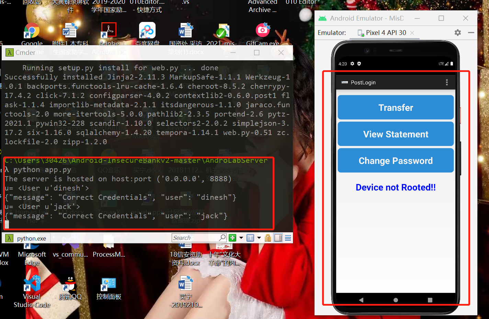

# 第八章 Android 缺陷应用漏洞攻击实验

## 实验目的
- 理解 Android 经典的组件安全和数据安全相关代码缺陷原理和漏洞利用方法；
- 掌握 Android 模拟器运行环境搭建和 ADB 使用；

## 实验内容
- [x] 详细记录实验环境搭建过程；
- 至少完成以下实验 ：
    + [x] Developer Backdoor
    + [x] Insecure Logging
    + [x] Android Application patching + Weak Auth
    + [x] Exploiting Android Broadcast Receivers
    + [x] Exploiting Android Content Provider
- [ ] 使用不同于 Walkthroughs 中提供的工具或方法达到相同的漏洞利用攻击效果；


## 实验环境搭建过程


本次实验需要的实验环境：
- [x] python2.7.18
- [x] Android-InsecureBankv2
- [x] Android SDK
- [x] apktool
- [x] jadx
- [x] dex2jar
- [x] AVD


#### 安装python
- 电脑上原先安装的版本是python3.7.12，卸载之后重新在[官网](https://www.python.org/ftp/python/2.7.18/python-2.7.18.msi)下载[python-2.7.18](https://www.python.org/ftp/python/2.7.18/python-2.7.18.msi),下载完成之后按提示安装。
- 添加环境变量

- 验证2.7.18的环境安装成功


#### 下载`Android-InsecureBankv2`仓库并完成`HTTP服务器`搭建
- 执行下列命令
    ```
    # 克隆仓库
    git clone https://github.com/c4pr1c3/Android-InsecureBankv2.git
    # 安装相关的依赖包
    pip install install -r requirements.txt
    ```

- 将当前目录更改为`AndroLabServer`文件夹，运行`HTTP`服务器
    ```
    python app.py
    ```
    

- 查看可选参数


- 将`InsecureBankv2.apk`安装到 AVD中


- 使用`...\Android-InsecureBankv2\Usage Guide.pdf  `中的用户名密码测试登录


#### Jadx
执行命令如下：
```
git clone https://github.com/skylot/jadx.git
cd jadx
gradlew.bat dist
```

`Jadx`搭建成功

#### dex2jar
在[官网](https://sourceforge.net/projects/dex2jar/files/dex2jar-2.0.zip/download)下载最新版并解压缩

#### APKTool

详细方法见[windows apktool的安装和使用网址](https://www.jianshu.com/p/e819e39a59cb)

## 实验过程

### Developer Backdoor

- 解压缩`InsecureBankv2.apk`

- 复制`classes.dex文件`到`dex2jar`目录下

- 将`.dex`文件转换为`.jar`文件
    ```
    d2j-dex2jar.bat classes.dex
    ```
    
    生成的jar文件为：`classes-dex2jar.jar`

- 使用`JADX-GUI`打开 `classes-dex2jar.jar`文件

发现了一个漏洞，该漏洞导致当用户名为`devadmin`时，使用**任意值(包括缺省)**均可登录

- 测试用`devadmin`和任意密码进行登录


### Insecure Logging
- 在命令行使用`adb logcat`记录登录相关日志
    ```
    adb logcat -> logcat.txt
    ```
    
- 启动 AVD 和应用程序，使用合法用户Jack登录并修改密码

- 在日志中可以查看到登录和修改密码的记录
    + 登录成功的记录，以及用户名和密码都可以查看到
    
    + 修改密码成功的凭据，修改过后的密码也以明文存储
    

### Android Application patching + Weak Auth

- 反编译InsecureBankv2.apk
    ```
    apktool d InsecureBankv2.apk
    ```
    

- 在反编译后的文件夹中找到`...\res\value\strings.xml`,修改`is_admin`的值


- 对修改过的反编译文件重新进行编译
    ```
    apktool b InsecureBankv2.rebuild
    ```
    

- 对新生成的apk文件签名，参考了本[网址](https://developer.android.com/studio/publish/app-signing.html?hl=zh-cn)实现这一步骤
    + 使用 Android Studio构建密钥
    
    
    + 对新生成的apk文件签名
    

- 将InsecureBankv2.apk卸载并重新安装


- 在 AVD 中打开程序，发现界面多了一个额外的`Create user`按钮


- 点击发现该按钮是不可使用的


### Exploiting Android Broadcast Receivers
- 在上一个实验中已经执行过了反编译`apktool d InsecureBankv2.apk`
- 在`InsecureBankv2.rebuild`文件夹中打开`AndroidManifest.xml`文件，找到`Broadcast`的相关参数


- 在逆向的代码中找到`Broadcast Receivers`传递的参数


- 打开应用，注意并不需要输入用户名和密码登录，然后输入（绕过登录直接修改密码）的命令
    ```
    adb shell am BroadCastReceiver --es phonenumber 5554 --es newpass Dinesh@123!
    ```
    
    同时AVD中发现收到了修改密码的信息，见上图右部分

### Exploiting Android Content Provider
- 反编译`apktool d InsecureBankv2.apk`
- 在`AndroidManifest.xml`文件中找到`TrackUserContentProvider`


- 再在反编译文件中查看`TrackUserContentProvider`相关代码，发现传递过来的参数（即登录的用户名）被插入了SQLLite数据库


- 可以直接使用命令行查看用户的登录信息，登录信息`id= , name= `以明文的方式记录在设备上
    ```
    adb shell content query --uri content://com.android.insecurebankv2.TrackUserContentProvider/trackerusers
    ```
    
    devadmin的登录记录优先级最高

### 遇到的问题和解决

- `pip install install -r requirements.txt`这一步刚开始一直报错，后来关闭了VPN采用国内镜像源解决，报错：
```
ERROR: Could not find a version that satisfies the requirement flask ERROR: No matching distribution found for flask
```
- 在第四个实验`Exploiting Android Broadcast Receivers`中命令行有输出但是 AVD 没有收到短信，而且手动输入用户名和密码也不可以登录，最后发现是运行`app.py`的命令行被关掉了，重新打开就可以正常完成实验。

### 参考资料

- [Android-InsecureBankv2](https://github.com/c4pr1c3/Android-InsecureBankv2)
- [文档](https://github.com/c4pr1c3/Android-InsecureBankv2/tree/master/Walkthroughs)
- [课堂视频](https://www.bilibili.com/video/BV1rr4y1A7nz?from=search&seid=6142859782746666446)