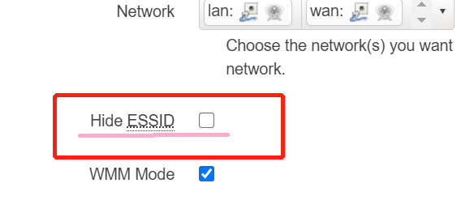
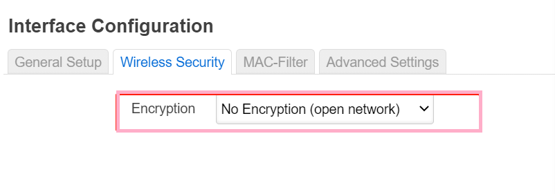
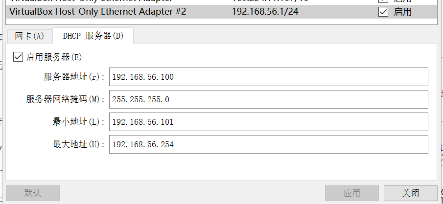
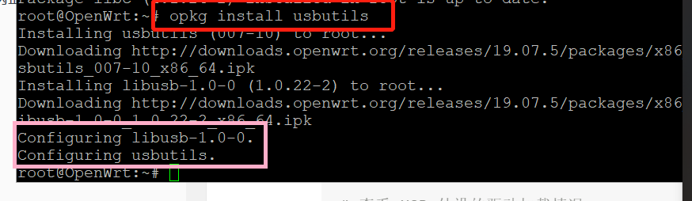

## OpenWrt 虚拟机搭建

### 实验目的

- 熟悉基于 OpenWrt 的无线接入点（AP）配置
- 为第二章、第三章和第四章实验准备好「无线软 AP」环境

### 实验环境

- 无线网卡 RT2800
- Virtualbox
- PuTTy

### 实验要求

- [x] 对照第一章实验无线路由器/无线接入点（AP）配置列的功能清单，找到在 OpenWrt 中的配置界面并截图证明；
- [x] 记录环境搭建步骤；
- [x] 如果 USB 无线网卡能在 OpenWrt 中正常工作，则截图证明；
- [x] 如果 USB 无线网卡不能在 OpenWrt 中正常工作，截图并分析可能的故障原因并给出可能的解决方法。

### 配置界面截图

- 重置和恢复AP到出厂默认设置状态


- 设置AP的管理员用户名和密码


- 设置SSID广播和非广播模式



- 配置不同的加密方式



- 设置AP管理密码


- 配置无线路由器使用自定义的DNS解析服务器


- 配置DHCP和禁用DHCP


- 开启路由器/AP的日志记录功能(对指定事件记录)


- 配置AP隔离(WLAN划分)功能
功能.png)

- 设置MAC地址过滤规则(ACL地址过滤器)


- 查看WPS功能的支持情况(未找到该信息，猜想是在日志记录中搜索，但并未有相关信息)

可能是问几种加密方式支不支持WPA？


- 查看AP/无线路由器支持哪些工作模式


### 环境搭建步骤

```
# 下载镜像文件
wget https://downloads.openwrt.org/snapshots/targets/x86/64/openwrt-x86-64-combined-squashfs.img.gz
# 解压缩
gunzip openwrt-x86-64-combined-squashfs.img.gz
# img 格式转换为 Virtualbox 虚拟硬盘格式 vdi
VBoxManage convertfromraw --format VDI openwrt-x86-64-combined-squashfs.img openwrt-x86-64-combined-squashfs.vdi
```
- 下载openwrt镜像


- 转换为vdi


- 新建虚拟机，使用得出的vdi作为虚拟硬盘，并完成网络配置
    ```
    进行必要的虚拟网卡设置。
    第一块网卡设置为：Intel PRO/1000 MT 桌面（仅主机(Host-Only)网络）
    第二块网卡设置为：Intel PRO/1000 MT 桌面（网络地址转换(NAT)）
    ```
    
    
    

- 网络连通性


- 配置host-only网卡的地址


- PuTTy连接虚拟机，方便命令操作


- 安装Luci

    + 需要的包
    
    
    + 安装
    

- 安装好 luci 后通过浏览器访问管理 OpenWrt 的效果截图。

- 登录后页面截图


- 安装usbutils 



- 查找网卡对应的驱动并安装，重启


- ifconfig -a查看到无线网卡


- 安装 2 个软件包：wpa-supplicant 和 hostapd ，重启之后刷新LuCi 网页，登入 LuCi 之后在顶部菜单 Network 里即可发现新增了一个菜单项 Wireless 。


- 进行配置修改


### USB 无线网卡是否能在 OpenWrt 中正常工作
- 启用网卡，未接入设备时状态如图


- **配置正常，但手机无法搜索到该网络，该网卡在另一虚拟机kali上也不能监听到任何包，故属于网卡硬件与本电脑不兼容的问题。~~八字不合~~**

- 使用同学的电脑进行同样的网卡操作配置，手机可以正常连接openwrt局域网，并能正常上网。


### 遇到的问题
- 如何在gitbash中使用wget命令，参考[博客](https://blog.csdn.net/eddy23513/article/details/106621754/).
- VBoxManage找不到命令，解决方法，将命令中的VBoxManage改为'c:\Program Files\Oracle\Virtualbox\VBoxManage.exe'即可正常使用
- 装好的openwrt无法正常上网


解决方案：关闭防火墙并关闭VPN(不知道原因，可能是玄学)

- 转换好的vdi文件一定要提前扩容再应用到虚拟机，如果先建虚拟机再扩容会导致实际内存空间分配过小，内存不足。


